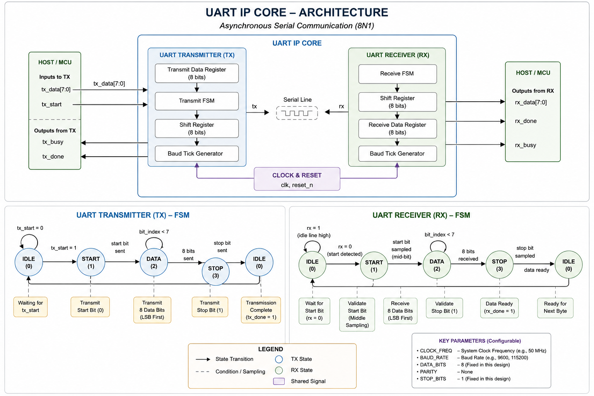
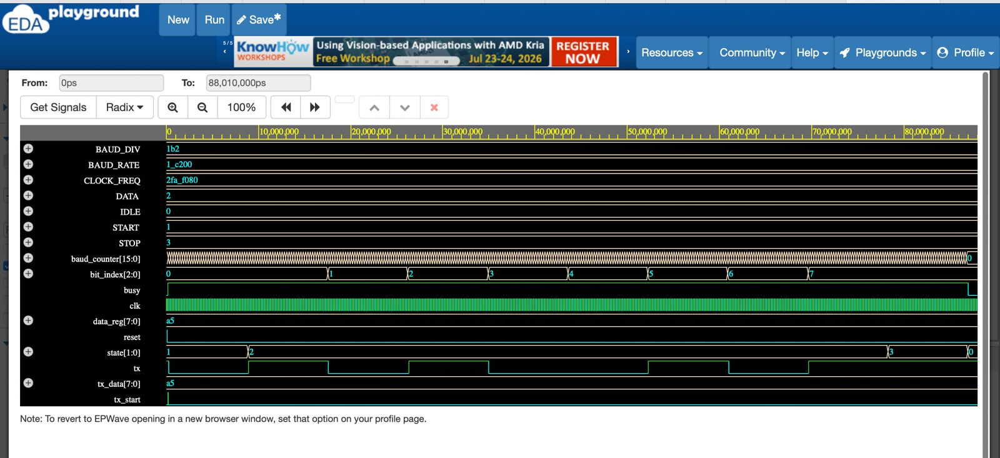
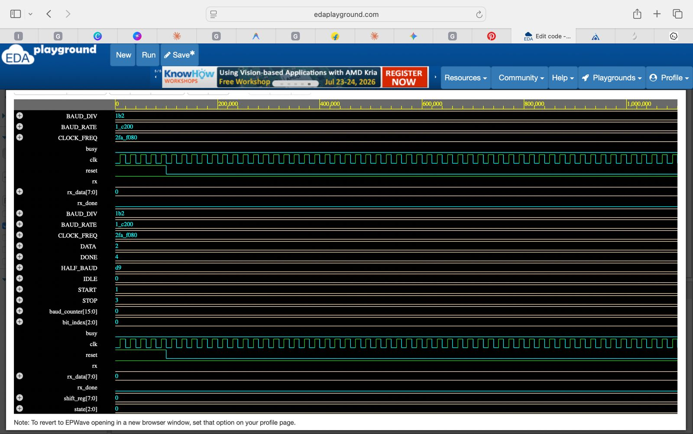

# UART IP Core

This repository contains my implementation of a UART (Universal Asynchronous Receiver/Transmitter) in Verilog HDL.

The goal of this project was to understand how serial communication works at the RTL level instead of simply using a pre-built UART IP. Everything was written from scratch as a learning project while studying digital design and Verilog.

The design currently includes:

- UART Transmitter
- UART Receiver
- Loopback Testbench
- Self-checking verification
- Parameterized clock frequency and baud rate

---

## Specifications

| Parameter | Value |
|-----------|-------|
| Clock Frequency | 50 MHz |
| Baud Rate | 115200 |
| Data Format | 8N1 |
| Parity | None |
| Stop Bits | 1 |

---
## Architecture

<p align="center">
  
</p>

## UART Transmitter Waveform

<p align="center">
  
</p>

## UART Receiver Waveform

<p align="center">
  
</p>

## Project Structure

```
uart-ip-core
│
├── rtl
│   ├── uart_tx.v
│   └── uart_rx.v
│
├── tb
│   ├── uart_tx_tb.v
│   └── uart_loopback_tb.v
│
├── README.md
└── .gitignore
```

---

## Features

### UART Transmitter

- Finite State Machine based design
- Configurable baud rate
- 8-bit data transmission
- Busy signal
- Start and stop bit generation

### UART Receiver

- Start bit detection
- Mid-bit sampling
- 8-bit data reception
- Stop bit verification
- Receive complete flag

---

## Verification

The transmitter and receiver were connected together using a loopback testbench.

The transmitter sends a byte over the serial line, and the receiver reconstructs it. The received byte is automatically compared against the transmitted byte to verify correct operation.

Current test:

```
Transmit : 0xA5

Receive  : 0xA5

PASS
```

---

## Tools Used

- Verilog HDL
- Icarus Verilog
- GTKWave / EPWave
- Visual Studio Code
- Git
- GitHub

---

## What I Learned

This project helped me understand:

- Finite State Machine (FSM) design
- UART communication protocol
- Baud rate generation
- Shift registers
- RTL design
- Verilog testbench development
- Waveform debugging
- Basic hardware verification

---

## Future Improvements

There are several features I plan to add as I continue improving this project:

- Shared baud generator
- UART FIFO
- Framing error detection
- Parity support
- Configurable stop bits
- UART top module
- Better verification with randomized test cases

---

## Author

**Chirrag Chhabria**

Electronics & Instrumentation Engineering  
Manipal Institute of Technology